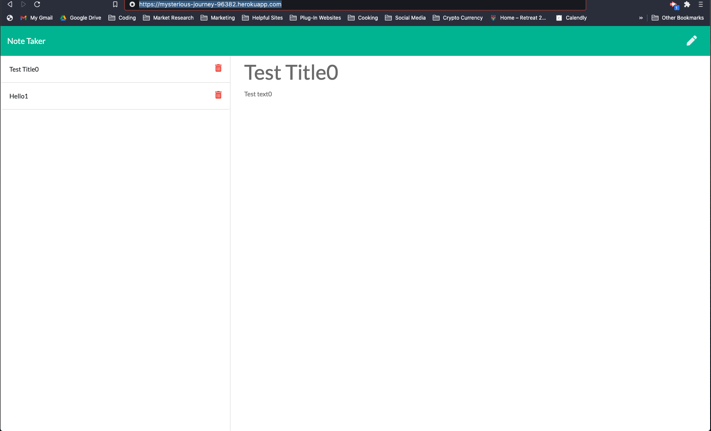
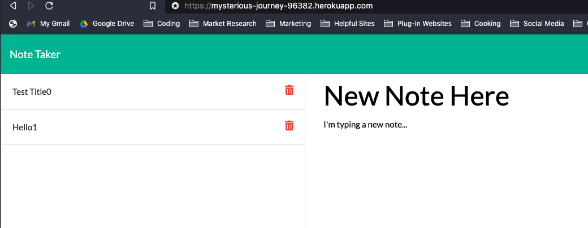
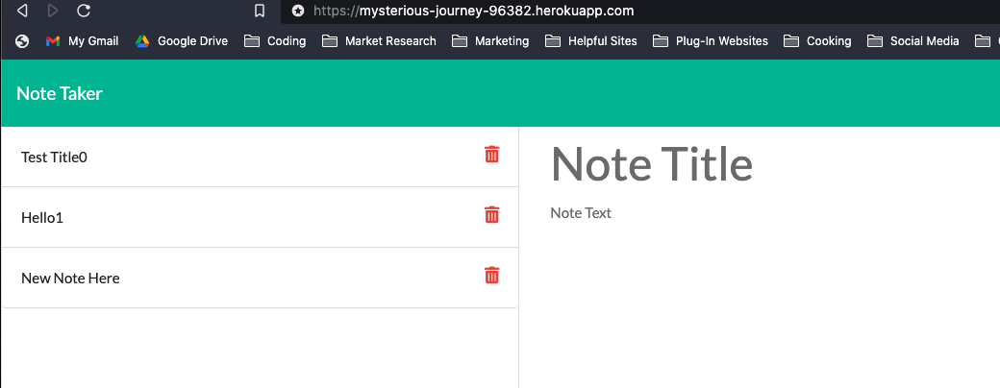

# 11 Express.js Challenge: NoteTaker (notetaker)

## A Note Taker App for a Small Busines Owner

The purpose of this project was to create the backend of an application that saves notes and can create new ones. This app runs on heroku and features various GET and POST actions.

https://mysterious-journey-96382.herokuapp.com/

## Installation

1. You can access the developer files here: https://github.com/vmcguire/notetaker
2. Download to your machine.
3. Access with npm start. (You may need to install npm).
4. Be sure to have the other files in the assets folder downloaded also to ensure their links exist.

## Usage

1. The application:

2. Typing in a new note after clicking the pencil button on the top right on the previous screen shot.

3. Saved note after clicking the save button in the top right corner of the first screen shot above.

## Credits

Victor McGuire

## License

**_ Copyright (c) 2020 Victor McGuire _**

Permission is hereby granted, free of charge, to any person obtaining a copy
of this software and associated documentation files (the "Software"), to deal
in the Software without restriction, including without limitation the rights
to use, copy, modify, merge, publish, distribute, sublicense, and/or sell
copies of the Software, and to permit persons to whom the Software is
furnished to do so, subject to the following conditions:

The above copyright notice and this permission notice shall be included in all
copies or substantial portions of the Software.

THE SOFTWARE IS PROVIDED "AS IS", WITHOUT WARRANTY OF ANY KIND, EXPRESS OR
IMPLIED, INCLUDING BUT NOT LIMITED TO THE WARRANTIES OF MERCHANTABILITY,
FITNESS FOR A PARTICULAR PURPOSE AND NONINFRINGEMENT. IN NO EVENT SHALL THE
AUTHORS OR COPYRIGHT HOLDERS BE LIABLE FOR ANY CLAIM, DAMAGES OR OTHER
LIABILITY, WHETHER IN AN ACTION OF CONTRACT, TORT OR OTHERWISE, ARISING FROM,
OUT OF OR IN CONNECTION WITH THE SOFTWARE OR THE USE OR OTHER DEALINGS IN THE
SOFTWARE.

---

© 2020 Victor McGuire, Confidential and Proprietary. All Rights Reserved.
